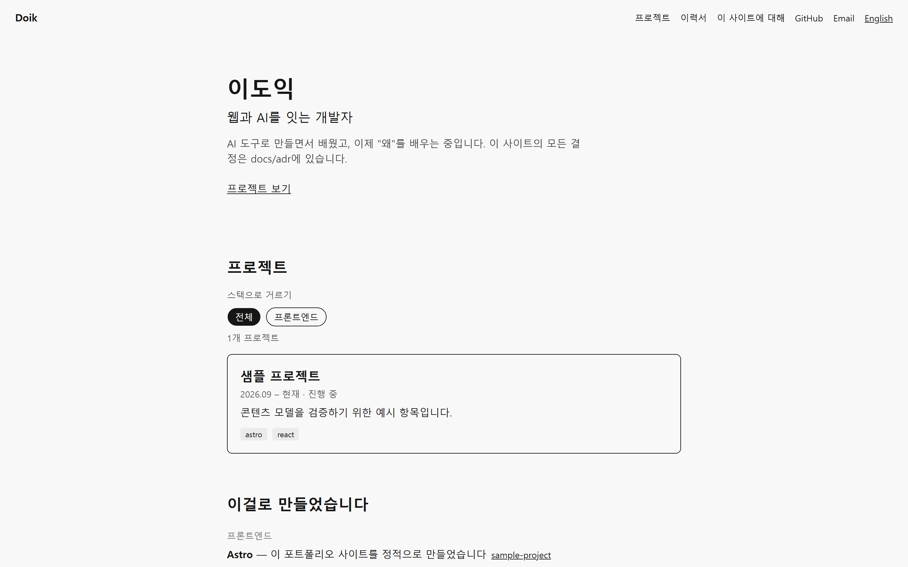

# Hello, I am Doik

웹·AI 개발자 이도익의 포트폴리오. https://hello-iam-doik.vercel.app



## 실행

```bash
corepack enable && pnpm install
pnpm dev        # http://localhost:4321
pnpm build && pnpm preview
```

## 콘텐츠는 어떻게 들어가나

모든 콘텐츠는 `content/`에 있다. 프로젝트 하나 = `content/projects/<slug>/` 폴더 하나(`meta.yaml` + `ko.md` + 선택적 `en.md` + `screens/`).
빌드 시 `src/content/schemas.ts`의 Zod 스키마가 검증하므로 누락 필드나 없는 이미지는 빌드를 실패시킨다. 절차는 [docs/content-guide.md](docs/content-guide.md).

## 왜 Astro인가, 왜 이렇게 만들었나

결정마다 기록이 있다: [docs/adr](docs/adr). 시작은 [0001 Astro over Next.js](docs/adr/0001-astro-over-nextjs.md).
구조 한 장: [docs/architecture.md](docs/architecture.md). 제작 방식과 AI 활용 공개: [docs/how-this-was-built.md](docs/how-this-was-built.md).

## 품질

`pnpm check` 타입 · `pnpm lint` Biome/Prettier · `pnpm test` 콘텐츠 계약 테스트 · `pnpm e2e` Playwright smoke/axe/SEO. CI가 이 전부를 PR마다 돌린다.
